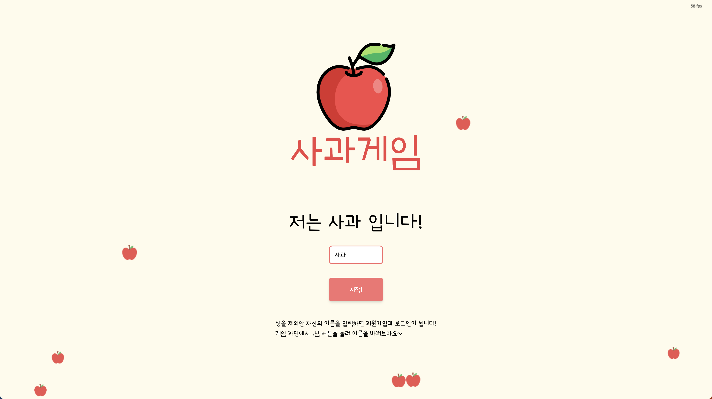
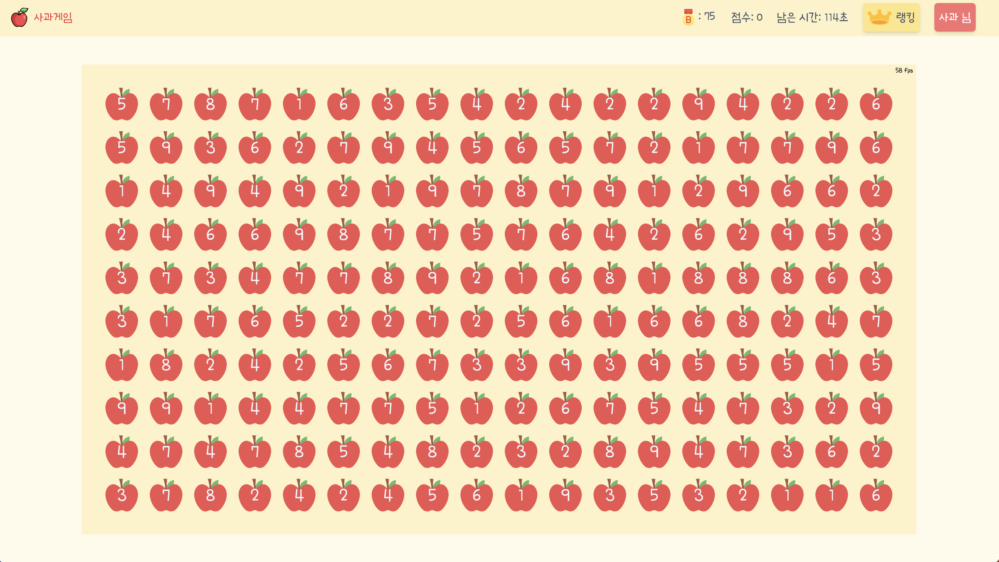
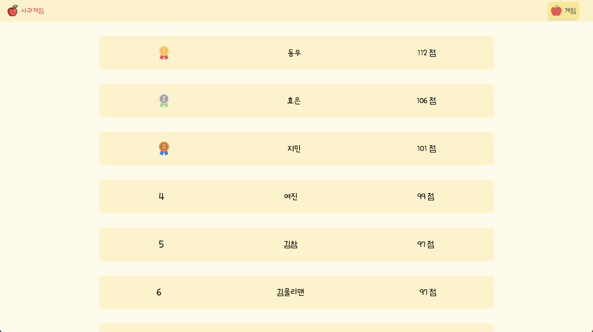
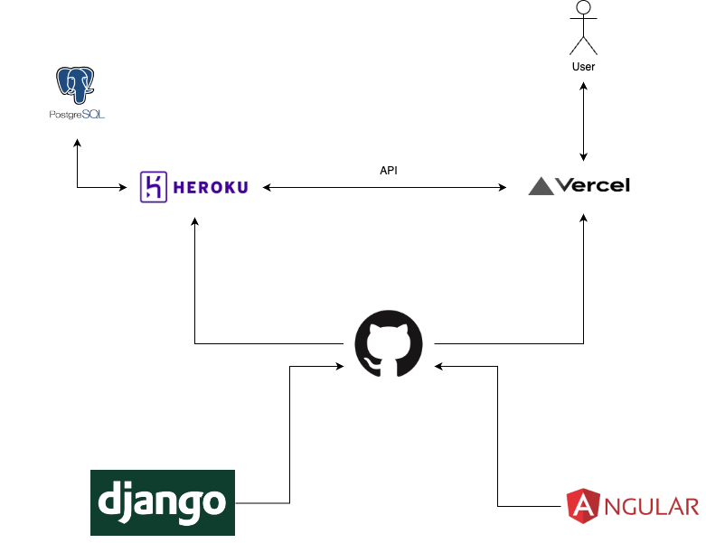
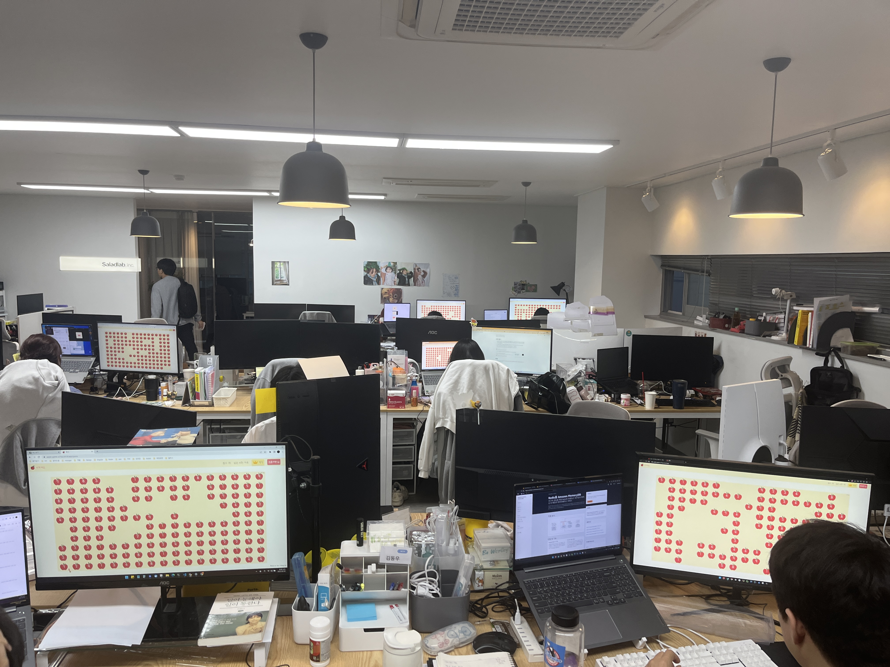

# 🍎 Apple Game
* **인턴으로 일하게된 회사에서 사용하는 Angular와 Django에 익숙해 지기 위한 토이 프로젝트**
* 드래그 영역의 사과의 숫자합이 10이 되면 사과의 개수 만큼 점수를 얻는 게임.

    
    
    

 
 

# 📋 목차
- [🍎 Apple Game](#-apple-game)
- [📋 목차](#-목차)
- [🩻 프로젝트 구조](#-프로젝트-구조)
- [😄 프로젝트 후기](#-프로젝트-후기)

 
 

# 🩻 프로젝트 구조

    

* 배포하는데 있어서 편리함을 추구한 도구 선택
* Front는 Vercel, Back은 Heroku
* 결과로 정말 간단한 프로젝트 아키텍처 탄생!
* 가격도 한달에 5$로 저렴

 
 

# 😄 프로젝트 후기
* 원작 게임도 정말 중독성이 강한 게임인데 정말 많은 회사 분들이 줄겨주셨다.
* 오랜만에 순수한 개발의 재미를 느꼈고 내가 어떤 개발자가 되고 싶은지 확고해진 계기가 되었다.
* 이에관한 회고를 notion에 정리했다!

    

> 사과에 점령당한 점심시간